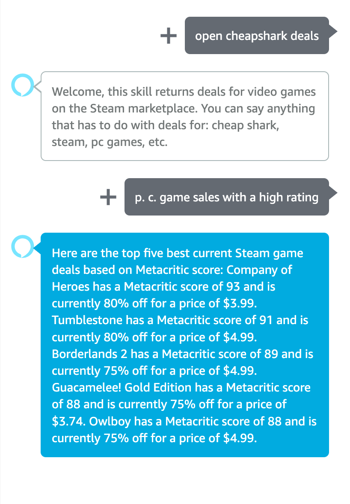

# CheapShark Game Deals for Amazon Alexa

A simple skill for the Amazon Alexa family of devices to retrieve Steam game deals using the [CheapShark API](https://apidocs.cheapshark.com/).

## Instructions

1. Open the skill by prompting Alexa with either of the following:

```
"Alexa, open cheapshark deals"

"open cheapshark deals"
```

2. Invoke any of the following intents:

| Name | Description | Utterances |
| --- | --- | --- |
| CheapSharkIntent | Returns the top five deals based on "deal rating," a rating determined by CheapShark using multiple stats | ```"video game sales"```, ```"steam game sales"```, ```"pc game sales"```, ```"game sales"```, ```"cheashark sales"```, ```"cheapshark deals"```, ```"game deals"```, ```"pc game deals"```, ```"video game deals"```, ```"steam game deals"```, |
| --- | --- | --- |
| CheapSharkPercentFilterIntent | Returns the top five (or less) deals that are above a certain user-specified percent off, descending | ```"video game sales above {salePercent} percent"```, ```"steam game sales above {salePercent} percent"```, ```"pc game sales above {salePercent} percent"```, ```"game sales above {salePercent} percent"```, ```"cheashark sales above {salePercent} percent"```, ```"cheapshark deals above {salePercent} percent"```, ```"game deals above {salePercent} percent"```, ```"pc game deals above {salePercent} percent"```, ```"video game deals above {salePercent} percent"```, ```"steam game deals above {salePercent} percent"```, |
| --- | --- | --- |
| CheapSharkScoreFilterIntent | Returns the top five deals based on Metacritic rating, descending | ```"video game sales with a high rating"```, ```"steam game sales with a high rating"```, ```"pc game sales with a high rating"```, ```"game sales with a high rating"```, ```"cheashark sales with a high rating"```, ```"cheapshark deals with a high rating"```, ```"game deals with a high rating"```, ```"pc game deals with a high rating"```, ```"video game deals with a high rating"```, ```"steam game deals with a high rating"```, |

## Examples

| CheapSharkIntent | CheapSharkPercentFilterIntent | CheapSharkScoreFilterIntent |
| --- | --- | --- |
|  |  |  |
